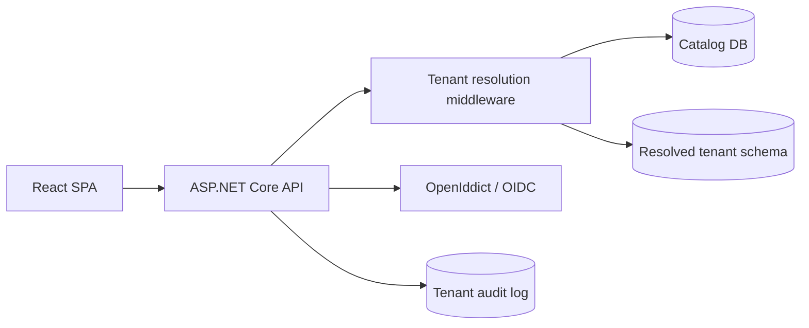

# Northstar Multi-Tenant SaaS Starter Kit

[](https://github.com/aktma/multi-tenant-saas/actions/workflows/ci.yml)

An open-source-quality .NET 10 + React starter for SaaS products that need tenant isolation, RBAC, and an enterprise-ready control plane.

## Stack

- .NET 10 Minimal API, Clean/Onion architecture, EF Core 10, Npgsql
- PostgreSQL with catalog database plus schema-per-tenant isolation
- ASP.NET Core authentication boundary designed for OpenIddict OAuth2/OIDC and Authorization Code + PKCE
- React 19, Vite, Tailwind CSS, Lucide icons
- Docker Compose and GitHub Actions

## Architecture



Projects follow the dependency direction `API -> Application -> Domain`; Infrastructure implements Application ports and is composed by the API.

## Quick start

```bash
docker compose up --build
```

- SPA: http://localhost:3000
- API health: http://localhost:8080/api/health
- PostgreSQL: localhost:5432, database `saas_catalog`, user/password `saas` / `saas`

For local backend development:

```bash
dotnet test MultiTenantSaaS.slnx
cd frontend && npm run build
```

Do not commit real secrets. Use `dotnet user-secrets` for local identity settings and environment variables or GitHub Secrets in CI.

## Tenant resolution decision

The starter uses `X-Tenant` as a simple local-development tenant selector, with a `tenant_id` claim fallback. The resolver looks up the tenant in the catalog, rejects non-provisioned tenants, and places the resolved tenant and schema on the scoped tenant context.

Header resolution is convenient for local development and API clients but must be protected by authentication and never trusted as an authorization decision. Subdomains are a better user-facing choice because they are visible and bookmarkable, but require wildcard DNS and proxy configuration. JWT-only resolution is strongest for machine-to-machine calls, but makes tenant switching for a SuperAdmin less explicit. A production deployment can replace `TenantResolver` with a subdomain resolver without changing application services.

## Security model

1. The catalog stores tenant identity, slug, domain, and provisioning state.
2. Every tenant schema is named from the immutable tenant ID (`tenant_<guid>`), never from user input.
3. `TenantDbContext` maps to the resolved schema and includes global query filters as defense in depth.
4. The model cache key includes the active schema, preventing an EF model built for one tenant from being reused for another.
5. JWTs are expected to carry `tenant_id`; production token validation must compare that claim with the resolved request tenant before accessing data.
6. Roles are tenant-scoped: `SuperAdmin`, `TenantAdmin`, `TenantUser`, and `ReadOnly`. Policies are expressed as claims/roles, not scattered role checks.
7. Sensitive operations belong in the per-tenant `AuditEntries` table. HTTPS, HSTS, a CORS allow-list, Identity password policy, and auth-endpoint rate limiting should be enabled per deployment environment.

## Provisioning workflow

The catalog is initialized by `scripts/seed.sql` with `acme-corp` and `orbit-labs`. A real provisioning command should:

1. Create the catalog tenant in `Pending` state.
2. Allocate the deterministic tenant schema.
3. Apply the tenant EF migration set to that schema.
4. Seed roles and the initial tenant administrator.
5. Mark the catalog row `Provisioned`, or `Failed` with a retryable error.

The seed intentionally creates users in different schemas so reviewers can verify that changing `X-Tenant: acme-corp` to `X-Tenant: orbit-labs` changes the data boundary.

## Repository layout

```text
src/
  MultiTenantSaaS.Domain          Entities and business vocabulary
  MultiTenantSaaS.Application     Tenant context, policies, application contracts
  MultiTenantSaaS.Infrastructure  EF Core, PostgreSQL, tenant resolution, logging
  MultiTenantSaaS.Api             Minimal API composition root and middleware
tests/                             xUnit tenant and authorization tests
frontend/                          React/Vite/Tailwind control-plane SPA
scripts/seed.sql                   Demo catalog and two tenant schemas
```

## Architecture decisions

- OpenIddict is the default OAuth2/OIDC server choice because it is open source and integrates directly with ASP.NET Core; the SPA uses Authorization Code + PKCE.
- CQRS/MediatR is intentionally kept at the application boundary; persistence concerns remain in Infrastructure.
- Schema-per-tenant is selected over row-only isolation for stronger PostgreSQL boundaries and simpler tenant export/restore operations. Global filters remain as a second line of defense.
