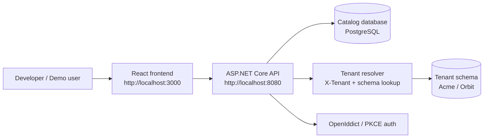

# Northstar Multi-Tenant SaaS Starter Kit

A local-first .NET 10 + React portfolio project for demonstrating multi-tenant SaaS architecture, tenant-aware RBAC, schema-per-tenant PostgreSQL isolation, and a realistic control-plane workflow.

## What this project demonstrates

- Multi-tenant SaaS structure with a catalog database and tenant-specific schemas
- Policy-based authorization and tenant-scoped roles
- ASP.NET Core minimal API frontend integration with OpenIddict/OIDC flows
- PostgreSQL-backed tenant provisioning and isolation patterns
- Docker-based local startup for fast onboarding and demo readiness

## Architecture



## Tech stack

### Frontend
- React 19 + Vite
- TypeScript
- Tailwind-inspired styling
- Local control-plane UI for tenant operations

### Backend
- ASP.NET Core minimal API
- .NET 10
- EF Core + Npgsql
- OpenIddict for local authentication and PKCE flow

### Infrastructure
- PostgreSQL 17
- Docker Compose for local startup
- Seeded demo tenants and users for easy walkthroughs

## Quick start

### Requirements
- Git
- Docker Desktop or Docker Engine

### Run locally

```bash
git clone <your-repo-url>
cd <repo-folder>
cp .env.example .env
docker compose up --build
```

Then open:
- Frontend: http://localhost:3000
- API: http://localhost:8080
- Health: http://localhost:8080/api/health
- Ready check: http://localhost:8080/api/health/ready
- Swagger: http://localhost:8080/swagger

## Default local demo values

The repository ships with safe demo defaults in [.env.example](.env.example). The stack starts with:

- PostgreSQL database: `saas_catalog`
- PostgreSQL user: `saas`
- PostgreSQL password: `saas`
- Demo admin account: `demo@northstar.local`
- Demo admin password: `NorthstarDemo!2026`

The demo password is intentionally simple for local use only. Do not reuse it outside a local environment.

## Demo workflow

The project is designed to demonstrate the core SaaS flow:

1. Open the frontend at http://localhost:3000
2. Sign in with the demo administrator account
3. Use the tenant selector to switch between the seeded tenants
4. Review the tenant-scoped user list, layouts, and audit logs
5. Confirm that the data boundary changes with the active tenant
6. Use the API and Swagger to inspect the tenant-aware contract

This is the quickest proof that the catalog + per-tenant schema isolation model is working as intended.

## Configuration

The local setup uses a root `.env` file, which keeps the startup values in one place. The default variables are:

```env
ASPNETCORE_ENVIRONMENT=Development
POSTGRES_DB=saas_catalog
POSTGRES_USER=saas
POSTGRES_PASSWORD=saas
VITE_API_URL=http://localhost:8080
AUTHENTICATION_AUTHORITY=http://localhost:8080
AUTHENTICATION_AUDIENCE=saas-api
CORS_ALLOWED_ORIGINS=http://localhost:3000
SEED_ENABLED=true
SEED_DEMO_PASSWORD=NorthstarDemo!2026
DATABASE_APPLY_MIGRATIONS=true
```

## Project structure

```text
.
├── docker-compose.yml
├── .env.example
├── README.md
├── frontend/
│   ├── src/
│   ├── Dockerfile
│   └── package.json
├── src/
│   ├── MultiTenantSaaS.Api/
│   ├── MultiTenantSaaS.Application/
│   ├── MultiTenantSaaS.Domain/
│   └── MultiTenantSaaS.Infrastructure/
├── tests/
│   └── MultiTenantSaaS.Tests/
├── scripts/
│   ├── seed.sql
│   └── smoke-test.sh
└── .gitignore
```

## Local verification

Use the included smoke script after startup:

```bash
bash scripts/smoke-test.sh
```

You can also run backend tests directly:

```bash
dotnet test MultiTenantSaaS.slnx
```

## Troubleshooting

### Ports are already in use
Check which process owns the port and stop it if needed:

```bash
netstat -ano | findstr :3000
netstat -ano | findstr :8080
netstat -ano | findstr :5432
```

### Containers do not start
Inspect the service logs:

```bash
docker compose logs -f
```

### Database initialization appears stuck
Reset the local demo database volume and restart:

```bash
docker compose down -v
docker compose up --build
```

> Warning: this deletes local demo data.

### Environment values are missing
Make sure a `.env` file exists at the repo root, based on [.env.example](.env.example).

## Architecture notes

- The catalog database stores tenant metadata and identity data.
- Each tenant uses its own schema in a shared PostgreSQL instance.
- A request resolves the tenant from the request context and then switches the EF model to the proper schema.
- The API validates identity and tenant membership before authorizing protected actions.

## Future improvements

- Add a richer tenant provisioning workflow UI
- Add tenant-specific data creation and management tools
- Expand audit log filters and export support
- Add automated end-to-end smoke tests for the login and tenant switch flow

## License

This project is provided for local demonstration and educational use. Review the repository license for terms before reuse.
