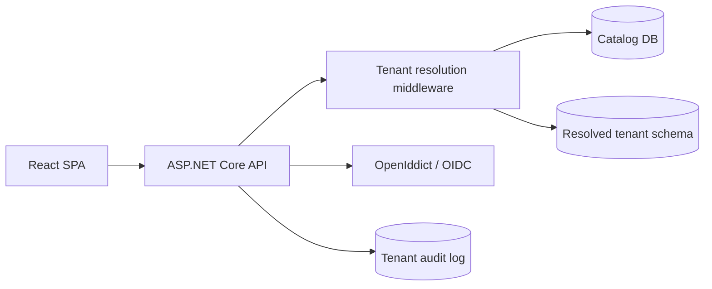

# Northstar Multi-Tenant SaaS Starter Kit

[](https://github.com/aktma/multi-tenant-saas/actions/workflows/ci.yml)

An open-source-quality .NET 10 + React starter for SaaS products that need tenant isolation, RBAC, and an enterprise-ready control plane.

## Stack

- .NET 10 Minimal API, Clean/Onion architecture, EF Core 10, Npgsql
- PostgreSQL with catalog database plus schema-per-tenant isolation
- ASP.NET Core authentication boundary designed for OpenIddict OAuth2/OIDC and Authorization Code + PKCE
- React 19, Vite, Tailwind CSS, Lucide icons
- Docker Compose and GitHub Actions

## Architecture



Projects follow the dependency direction `API -> Application -> Domain`; Infrastructure implements Application ports and is composed by the API.

## Quick start

```bash
docker compose up --build
```

- SPA: http://localhost:3000
- API health: http://localhost:8080/api/health
- PostgreSQL: localhost:5432, database `saas_catalog`, user/password `saas` / `saas`

For local backend development:

```bash
dotnet test MultiTenantSaaS.slnx
cd frontend && npm run build
```

Apply the catalog migration against a running PostgreSQL instance with:

```bash
dotnet tool restore
dotnet ef database update --project src/MultiTenantSaaS.Infrastructure --startup-project src/MultiTenantSaaS.Api --context CatalogDbContext
```

The test suite includes a Docker-backed PostgreSQL isolation test. It creates `tenant_a` and `tenant_b`, inserts distinct memberships, and asserts that an EF context resolved for Tenant A cannot read Tenant B's row. Docker Desktop must be running to execute this integration test.

After applying the migration, enable the local identity seed with user secrets or environment variables. This registers the `northstar-spa` PKCE client, the `saas-api` scope, default roles, and an optional demo administrator:

```bash
dotnet user-secrets --project src/MultiTenantSaaS.Api set "Seed:Enabled" true
dotnet user-secrets --project src/MultiTenantSaaS.Api set "Seed:DemoPassword" "use-a-local-password"
```

Do not commit real secrets. Use `dotnet user-secrets` for local identity settings and environment variables or GitHub Secrets in CI.

## Tenant resolution decision

The starter uses `X-Tenant` as a simple local-development tenant selector, with a `tenant_id` claim fallback. The resolver looks up the tenant in the catalog, rejects non-provisioned tenants, and places the resolved tenant and schema on the scoped tenant context.

Header resolution is convenient for local development and API clients but must be protected by authentication and never trusted as an authorization decision. Subdomains are a better user-facing choice because they are visible and bookmarkable, but require wildcard DNS and proxy configuration. JWT-only resolution is strongest for machine-to-machine calls, but makes tenant switching for a SuperAdmin less explicit. A production deployment can replace `TenantResolver` with a subdomain resolver without changing application services.

## Security model

1. The catalog stores tenant identity, slug, domain, and provisioning state.
2. Every tenant schema is named from the immutable tenant ID (`tenant_<guid>`), never from user input.
3. `TenantDbContext` maps to the resolved schema and includes global query filters as defense in depth.
4. The model cache key includes the active schema, preventing an EF model built for one tenant from being reused for another.
5. JWTs must carry `tenant_id`; the API compares that claim with the resolved request tenant before accessing protected data and returns `403 Forbidden` for missing or mismatched claims.
6. Roles are tenant-scoped: `SuperAdmin`, `TenantAdmin`, `TenantUser`, and `ReadOnly`. Policies are expressed as claims/roles, not scattered role checks.
7. Sensitive operations belong in the per-tenant `AuditEntries` table. HTTPS, HSTS, a CORS allow-list, Identity password policy, and auth-endpoint rate limiting should be enabled per deployment environment.

The API now validates configured issuer, audience, token lifetime, and a one-minute clock skew. CORS is restricted to configured SPA origins, HSTS is enabled outside development, and a reusable fixed-window rate-limit policy is registered for authentication endpoints.

ASP.NET Core Identity and OpenIddict are persisted in the catalog database. The server is configured for Authorization Code + PKCE and refresh tokens. Login, logout, authorization, and token exchange handlers use the Identity application cookie and OpenIddict server scheme. Development uses an ephemeral signing key; non-development environments require an explicit PFX signing certificate path and secret. The opt-in catalog seeder registers the SPA client, API scope, default roles, and optional demo user after migrations have been applied. Authorization now requires an explicit cookie-authenticated consent decision with five-minute, Data Protection-backed state. Demo tenant membership seeding is included in `scripts/seed.sql`.

Tenant memberships live inside each tenant schema. The authorization-code handler reads the membership for the resolved tenant and emits that role into the access token. Membership creation is restricted by the `CanManageUsers` policy and accepts only the four supported tenant roles, so a role assigned in one tenant cannot authorize actions in another.

The isolation test is intentionally explicit because it protects the most important production invariant: tenant A must never read or mutate tenant B data, even when both schemas share the same database server.

Tenant user management is available through `GET /api/users` and policy-protected `POST /api/users`. User creation, membership creation, and the `user.created` audit entry are committed in one tenant-schema transaction. The list endpoint joins users to memberships inside the resolved schema, so it cannot return users from another tenant.

Tenant settings are available through `GET /api/tenant-settings` and TenantAdmin/SuperAdmin-protected `PUT /api/tenant-settings`. Organization name, domain, and branding color are persisted in the catalog. `GET /api/audit-log` provides tenant-filtered, paginated audit events with an optional action filter; callers never supply a schema or tenant ID for the query.

The React control plane now includes responsive views for Overview, People, Roles & access, Audit log, Tenant settings, and Billing. People, Audit log, and Tenant settings load from the authenticated API client, with loading/error and local preview fallback states.

The SPA now checks `/api/session` with the Identity application cookie and presents a login gate when no session is present. After password login, it starts Authorization Code + PKCE, stores only the short-lived verifier/state in session storage, exchanges the callback code for an access token, and sends that bearer token on tenant-scoped requests. The authorization URL carries the selected tenant slug; the API resolves it, loads membership claims from that schema, and emits the matching `tenant_id` claim. Tenant-scoped requests use `VITE_API_URL` (defaulting to `http://localhost:8080`) and send the selected `X-Tenant` slug. In local development, the API CORS policy allows credentialed requests from `http://localhost:3000`.

The API exposes `/api/health` for liveness and `/api/health/ready` for PostgreSQL readiness. Local Compose enables `Database:ApplyMigrations`; production keeps runtime migrations disabled by default and should run the catalog migration as a single deployment job.

## Provisioning workflow

The catalog is initialized by `scripts/seed.sql` with `acme-corp` and `orbit-labs`. The protected `POST /api/tenants` command performs the provisioning workflow:

1. Create or reuse the catalog tenant in `Pending` state.
2. Allocate the deterministic tenant schema from the immutable tenant ID.
3. Create the tenant tables and indexes in that schema using idempotent DDL.
4. Mark the catalog row `Provisioned`, or `Failed` with a retryable error.

Provisioning accepts only lowercase slug identifiers, is safe to retry for an already-provisioned slug, and never interpolates user input into a PostgreSQL identifier. A future migration runner can replace the idempotent bootstrap DDL with versioned tenant migrations without changing the endpoint contract.

The seed intentionally creates users in different schemas so reviewers can verify that changing `X-Tenant: acme-corp` to `X-Tenant: orbit-labs` changes the data boundary.

## Repository layout

```text
src/
  MultiTenantSaaS.Domain          Entities and business vocabulary
  MultiTenantSaaS.Application     Tenant context, policies, application contracts
  MultiTenantSaaS.Infrastructure  EF Core, PostgreSQL, tenant resolution, logging
  MultiTenantSaaS.Api             Minimal API composition root and middleware
tests/                             xUnit tenant and authorization tests
frontend/                          React/Vite/Tailwind control-plane SPA
scripts/seed.sql                   Demo catalog and two tenant schemas
```

## Architecture decisions

- OpenIddict is the default OAuth2/OIDC server choice because it is open source and integrates directly with ASP.NET Core; the SPA uses Authorization Code + PKCE.
- CQRS/MediatR is intentionally kept at the application boundary; persistence concerns remain in Infrastructure.
- Schema-per-tenant is selected over row-only isolation for stronger PostgreSQL boundaries and simpler tenant export/restore operations. Global filters remain as a second line of defense.
